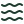
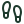

# Loic Bachellerie

Full-stack product engineer in Kelowna, BC, and co-founder of Founder Feast.

Born in France, in Canada for the last 13 years. I built my first PHP websites at 15 and never really stopped: today it's Vue/Nuxt web apps, React Native mobile apps and AI products, with a soft spot for hardware that phones home, like IoT devices and GPS trackers.

🇫🇷 French · 🇬🇧 English · 🇪🇸 Spanish

## What I build

<table>
  <tr><td align="center" width="110"><picture><source media="(prefers-color-scheme: dark)" srcset="assets/icons/globe-dark.svg"></picture> <b>Web apps</b></td><td align="center" width="110"><picture><source media="(prefers-color-scheme: dark)" srcset="assets/icons/smartphone-dark.svg"></picture> <b>Mobile apps</b></td><td align="center" width="110"><picture><source media="(prefers-color-scheme: dark)" srcset="assets/icons/bot-dark.svg"></picture> <b>AI systems</b></td><td align="center" width="110"><picture><source media="(prefers-color-scheme: dark)" srcset="assets/icons/radar-dark.svg"></picture> <b>IoT &amp; trackers</b></td></tr>
</table>

## Now: building [Founder Feast](https://founderfeast.com)

An invite-only dinner club for founders. Every Thursday, five hand-matched founders share a table at a restaurant we picked, in Vancouver, San Francisco and Los Angeles. 100+ founders have taken a seat so far.

A Nuxt web app and a React Native app on iOS and Android.

[founderfeast.com](https://founderfeast.com) · [App Store](https://apps.apple.com/ca/app/founder-feast/id6765519776) · [Google Play](https://play.google.com/store/apps/details?id=com.founderfeast.app)

## Stack

<table>
  <tr><td><b>Frontend</b></td><td></td></tr>
  <tr><td><b>Mobile</b> (React Native / Expo)</td><td></td></tr>
  <tr><td><b>Backend &amp; data</b></td><td></td></tr>
  <tr><td><b>Infra &amp; tools</b></td><td></td></tr>
</table>

## Off the keyboard

Most of my week is code, and this is the rest of it.

<table>
  <tr><td align="center" width="110"><picture><source media="(prefers-color-scheme: dark)" srcset="assets/icons/motorbike-dark.svg"></picture> <b>Motorcycling</b></td><td align="center" width="110"><picture><source media="(prefers-color-scheme: dark)" srcset="assets/icons/tent-dark.svg"></picture> <b>Camping</b></td><td align="center" width="110"><picture><source media="(prefers-color-scheme: dark)" srcset="assets/icons/mountain-dark.svg"></picture> <b>Hiking</b></td><td align="center" width="110"><picture><source media="(prefers-color-scheme: dark)" srcset="assets/icons/waves-dark.svg"></picture> <b>Wakesurfing</b></td></tr>
  <tr><td align="center" width="110"><picture><source media="(prefers-color-scheme: dark)" srcset="assets/icons/snowboarding-dark.svg"></picture> <b>Ski &amp; snowboard</b></td><td align="center" width="110"><picture><source media="(prefers-color-scheme: dark)" srcset="assets/icons/karate-dark.svg"></picture> <b>Muay Thai</b></td><td align="center" width="110"><picture><source media="(prefers-color-scheme: dark)" srcset="assets/icons/dumbbell-dark.svg"></picture> <b>Hyrox</b></td><td align="center" width="110"><picture><source media="(prefers-color-scheme: dark)" srcset="assets/icons/run-dark.svg"></picture> <b>Run club</b></td></tr>
  <tr><td align="center" width="110"><picture><source media="(prefers-color-scheme: dark)" srcset="assets/icons/guitar-dark.svg"></picture> <b>Guitar</b></td><td align="center" width="110"><picture><source media="(prefers-color-scheme: dark)" srcset="assets/icons/clapperboard-dark.svg"></picture> <b>Video editing</b></td><td align="center" width="110"><picture><source media="(prefers-color-scheme: dark)" srcset="assets/icons/footprints-dark.svg"></picture> <b>Country dancing</b></td><td align="center" width="110"><picture><source media="(prefers-color-scheme: dark)" srcset="assets/icons/code-dark.svg"></picture> <b>Side projects</b></td></tr>
</table>

## Activity

Most of my commits land in private product repos; the numbers below include them.

<picture>
  <source media="(prefers-color-scheme: dark)" srcset="https://raw.githubusercontent.com/bachellerieloic/bachellerieloic/output/github-snake-dark.svg">
  <source media="(prefers-color-scheme: light)" srcset="https://raw.githubusercontent.com/bachellerieloic/bachellerieloic/output/github-snake.svg">
  
</picture>

## Contact

[LinkedIn](https://www.linkedin.com/in/loic-bachellerie) · [founderfeast.com](https://founderfeast.com) · [loicb.tech](https://loicb.tech) · [loicbachellerie@me.com](mailto:loicbachellerie@me.com)
